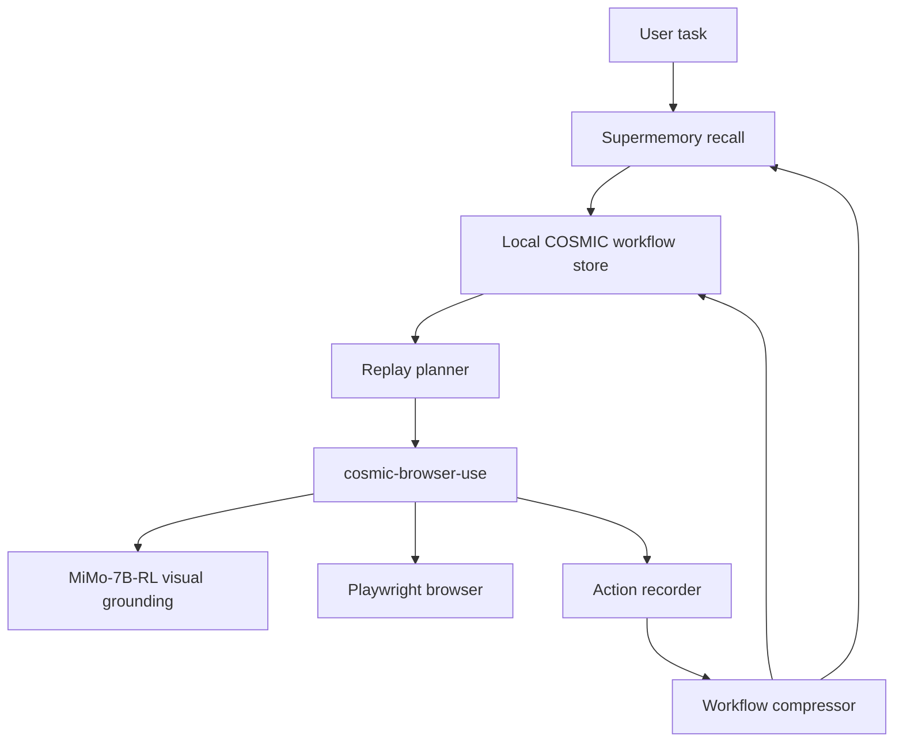

# COSMIC Browser Memory

## Indexing the Web for Agents

COSMIC Browser Memory is a **web traversal memory layer for browser agents**.

Search engines indexed web pages for humans. COSMIC indexes how agents move through websites: page states, screenshots, visual anchors, actions, coordinates, failures, fixes, and successful workflows.

Every successful browser run becomes reusable intelligence for future tasks.

---

## Why This Matters

Browser agents can browse real websites, but most of them are stateless. They rediscover the same interfaces every run: where the search bar is, which button opens the result, how to expand hidden content, what failed last time, and where the successful path was.

COSMIC changes that.

On the first run, the browser agent completes a task normally while COSMIC records the traversal path. After the task succeeds, COSMIC compresses the run into a reusable workflow, stores the executable route locally, and writes semantic workflow memory to Supermemory.

On future runs, the agent retrieves relevant prior workflows, loads the executable route, adapts task-specific values, replays safe known actions, and hands control back to live vision whenever the website has changed or confidence drops.

```text
First run:   explore -> complete task -> index route
Future run:  recall route -> replay known actions -> use live vision only where needed
```

---

## What COSMIC Indexes

COSMIC does not just store text summaries. It stores traversal intelligence:

| Memory Type | What Gets Stored |
|---|---|
| Page states | URL, title, viewport, scroll position, screenshots, visible markers |
| Visual indexes | MiMo-grounded pixel coordinates plus normalized viewport coordinates |
| Actions | Navigate, click, type, scroll, expand, extract, save |
| Workflows | Ordered successful paths with checkpoints and replay policies |
| Failures | Bad clicks, wrong targets, loops, dead ends, failed selectors |
| Fixes | Failure patches and replay guardrails |
| Semantic recall | Workflow summaries, intent, domain, task type, user context via Supermemory |

```json
{
  "workflow_id": "youtube_video_description_success",
  "domain": "youtube.com",
  "intent": "Find a YouTube video and extract its description",
  "steps": [
    {
      "action_type": "VisualClick",
      "target_description": "YouTube search bar",
      "normalized_coordinates": {"x": 0.465625, "y": 0.038889},
      "replay_safe": true
    }
  ],
  "failure_patches": [
    {
      "failure": "Clicked wrong search result",
      "fix": "Verify title/channel before continuing to description extraction"
    }
  ]
}
```

---

## Core Architecture

COSMIC runs on top of `cosmic-browser-use`, a vision-dominant browser automation agent that can see and operate real websites.

The browser agent uses:

- **Playwright** for browser control.
- **MiMo-7B-RL / MiMo-VL-7B-RL** for visual grounding from screenshots to page coordinates.
- A provider LLM for planning and workflow adaptation.
- **Supermemory** for semantic workflow recall.
- Local JSON workflow storage for deterministic replay.



Mental model:

```text
Supermemory = semantic memory brain
COSMIC route memory = executable traversal map
MiMo-7B-RL = visual grounding model
Playwright = browser hands
```

---

## Demo: Learn Once, Reuse Forever

### 1. Baseline / learning run

```powershell
cd "C:\Users\Praveen Raj U S\Downloads\agent-browser-index\cosmic-browser-use"

python main.py `
  --provider google_gemini `
  --interaction-mode vision `
  --memory-mode learn `
  --goal "Get the YouTube video description for the official OpenAI GPT-4o launch video" `
  --demo-overlay
```

The agent explores normally, records the route, compiles the successful run into workflow memory, and writes semantic recall data to Supermemory.

### 2. Recall / replay run

```powershell
python main.py `
  --provider google_gemini `
  --interaction-mode vision `
  --memory-mode recall `
  --goal "Get the YouTube video description for the official Claude Code launch video" `
  --demo-overlay
```

COSMIC retrieves the related YouTube description workflow, adapts the search query, replays safe visual-indexed actions, checkpoints on dynamic target selection, and uses live vision only where necessary.

### 3. Original non-memory route

```powershell
python main.py `
  --provider google_gemini `
  --interaction-mode vision `
  --memory-mode off `
  --goal "Get the YouTube video description for the official Claude Code launch video"
```

This runs the browser agent without COSMIC recall, useful for comparing first-run exploration against second-run memory.

---

## Memory Modes

| Mode | Behavior |
|---|---|
| `off` | Run the normal vision browser agent with no cross-run memory. |
| `learn` | Run normally, then index the successful traversal into COSMIC + Supermemory. |
| `recall` | Retrieve a workflow first, replay safe known actions, then resume live planning. |
| `auto` | Recall first, then write the completed run back into memory. |

---

## Supermemory Integration

COSMIC uses Supermemory as the semantic memory layer, not as the exact execution database.

Supermemory stores:

- workflow summaries
- task intent
- site/domain notes
- failure patches
- user preferences
- “what worked last time”

Local COSMIC storage keeps:

- exact step order
- visual coordinates
- screenshots
- replay policies
- checkpoints
- raw trace evidence

```python
from supermemory import Supermemory

client = Supermemory(api_key=os.environ["SUPERMEMORY_API_KEY"])

client.add(
    content="Browser traversal workflow summary...",
    container_tag="cosmic-hackathon-demo:demo_user",
    task_type="memory",
)

client.search.memories(
    q="Find prior YouTube video description workflows",
    container_tag="cosmic-hackathon-demo:demo_user",
    search_mode="hybrid",
)
```

Demo line:

> Supermemory remembers the context. COSMIC remembers the route.

---

## Voice and Email Task Ingress

COSMIC is designed to be invoked beyond the CLI.

### AgentPhone

The `AgentPhone/` folder contains a standalone AgentPhone integration for live call and SMS workflows. A user can call the agent, describe a browser task, and route that task into COSMIC.

```powershell
cd AgentPhone
python provision.py
uvicorn webhook_server:app --host 0.0.0.0 --port 8765
python make_call.py +15551234567
```

### AgentMail

COSMIC also supports the same product pattern for AgentMail-style task ingress: a user can email a web task such as:

```text
Get me the latest 1040NR tax form.
```

The browser agent can browse for the requested item, complete the task, and reply with the result or attachment through the mail layer.

---

## Repository Layout

```text
agent-browser-index/
  cosmic-browser-use/
    main.py                         # CLI + run loop
    browser_controller.py           # Playwright + MiMo-7B-RL actions
    orchestrator.py                 # LLM planning and replay adaptation
    memory_manager.py               # in-run memory and summaries
    cosmic_memory/
      replay.py                     # indexed replay execution
      indexer.py                    # successful-run workflow distillation
      trace_compiler.py             # trace -> workflow compiler
      supermemory_client.py         # Supermemory semantic memory bridge
      demo_overlay.py               # live demo overlay
    scripts/
      index_run.py                  # index an existing run
      smoke_supermemory.py          # Supermemory smoke test
  AgentPhone/
    webhook_server.py               # voice/SMS webhook server
    make_call.py                    # outbound call test client
    provision.py                    # AgentPhone setup helper
```

---

## Setup

```bash
cd cosmic-browser-use
pip install -r requirements.txt
playwright install chromium
```

Create `.env` from `.env.example` and configure:

```bash
SUPERMEMORY_API_KEY=
MIMO_API_URL=http://your-mimo-server/v1/
COSMIC_MEMORY_MODE=off
COSMIC_INTERACTION_MODE=vision
```

The demo CLI uses `--provider google_gemini` as the public-facing provider label while preserving the existing internal provider wiring and environment variables.

---

## Why This Is Different

Browser skills tell an agent how a site works.

COSMIC remembers what the agent actually did, where it succeeded, where it failed, and how to continue next time.

```text
Most browser agents retry.
COSMIC remembers.
```

---

## Hackathon Pitch

> We are indexing the web for agents.
>
> Google indexed pages for humans. COSMIC indexes traversal paths for agents: page states, screenshots, visual anchors, actions, failures, fixes, and successful workflows.
>
> Every successful browser run becomes reusable intelligence.
