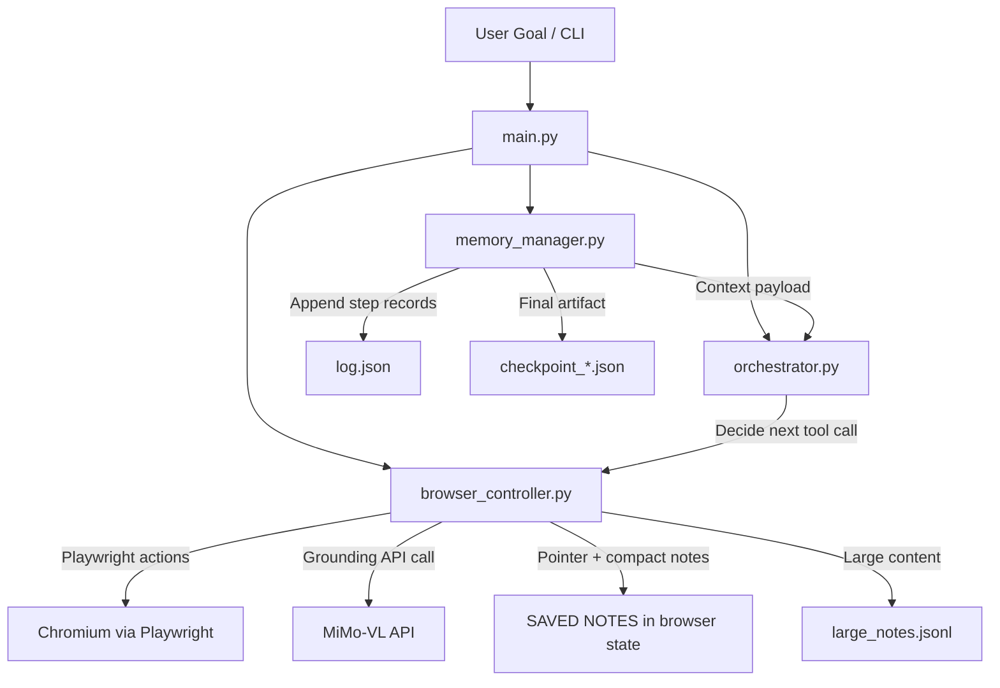
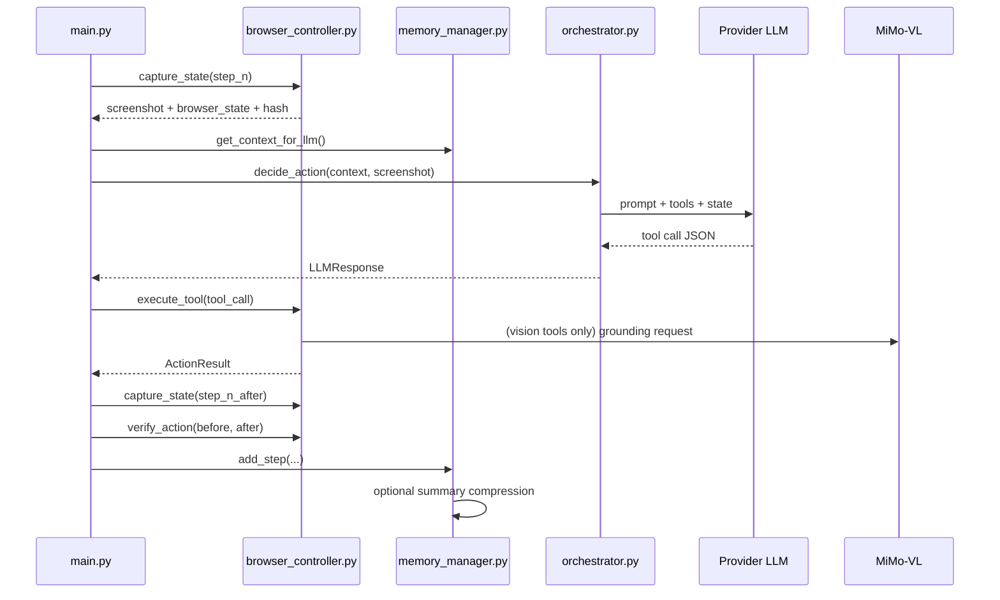

# Cosmic Browser Use Agent

Production-oriented, vision-first browser automation built on Playwright + MiMo-VL + multi-provider LLM orchestration.

## What This Project Is

Cosmic Browser Use Agent is an autonomous web task runner that:
- Decides actions with an LLM orchestrator.
- Grounds visual targets on screenshots using MiMo-VL.
- Executes atomic actions through Playwright.
- Maintains layered memory for long-running tasks.

It is designed for real browsing environments where DOM-only automation is brittle.

## Highlights

- Vision-first control loop with screenshot-grounded actions.
- Multi-provider orchestration (OpenAI, Anthropic, Gemini; plus provider abstraction for vLLM in code).
- Atomic tool model with robust recovery behavior.
- Memory compression + rolling context window to keep long tasks stable.
- Two-level notes architecture:
`SaveNote` for concise memory and `SaveLargeNote` for large extracts with searchable pointers.
- Production guardrails:
tab limits, loop detection, dialog auto-accept, anti-automation hardening, retry/escalation paths.

## Architecture



## Runtime Loop (Step-by-Step)



## Code Map

- `main.py`
Entry point, CLI, provider config, MiMo health pre-check, main execution loop, final stats.
- `orchestrator.py`
LLM provider adapters + tier selection + prompt construction + JSON parsing.
- `browser_controller.py`
Playwright lifecycle, tool execution, MiMo grounding calls, note systems, tabs, waits, navigation, screenshot, ask-user.
- `memory_manager.py`
Step persistence (`log.json`), cumulative summary, periodic compression, context assembly, loop detection, history reads.
- `cosmic_types.py`
Enums/dataclasses for tool actions, action results, task config, LLM config, step schema.
- `find_coordinates_mimo.py`
Standalone MiMo grounding/navigation utility + health check helper used by `main.py`.
- `config.py`
Central defaults for keys/models/limits/timing.

## Memory Architecture

### Rolling-Window + Compressed History

The agent does not send full history to the LLM every step. It sends:
- Current browser state.
- Recent tool output (if any).
- Cumulative compressed summary.
- Saved notes (compact persistent memory).

Compression strategy:
- Every `summary_interval` steps (default 10), summarize only the unsummarized segment while keeping a sliding window of recent steps uncompressed.
- This keeps context growth controlled while preserving key events and failures.

```ascii
Time --------------------------------------------------------------->>

[Old Steps......................][Recent Window][Current Step]
   compressed into summary           raw/full        raw/full

Context sent to LLM each turn:
  - BrowserState (current)
  - Saved Notes (always visible)
  - Cumulative Summary (compressed past)
  - Last Action Output (if present)
```

```mermaid
flowchart LR
    S[Steps[] in memory] --> SUM[Cumulative Summary]
    S --> RAW[Recent uncompressed steps]
    S --> RH[ReadHistory range output]
    S --> LOG[log.json persistence]
    SUM --> CTX[Context for Orchestrator]
    RAW --> CTX
    N[Saved Notes] --> CTX
    L[Last Action Output] --> CTX
    LN[large_notes.jsonl] --> PTR[Pointer notes in Saved Notes]
    PTR --> CTX
```

### Log-Backed Memory and Look-Back

- Each step is appended to in-memory `steps` and persisted to `log.json`.
- `ReadHistory(start_step, end_step)` returns detailed per-step records for look-back usage in the current run.
- At task end, `checkpoint_*.json` persists full run state and summary.

## Notes System (Two-Level Memory)

### 1) `SaveNote` (Primary)

Use for concise facts, decisions, extracted values, and progress markers.

Policy behaviors:
- Rejects empty notes.
- Token-aware note budget (default total budget: 2000 tokens across saved notes).
- If note is large (default threshold: 300 tokens) or budget would overflow, it reroutes to `SaveLargeNote`.

### 2) `SaveLargeNote` (Overflow / Bulk Storage)

Use only for long content:
DOM dumps, long articles, transcripts, large tables, etc.

Policy behaviors:
- Rejects empty content.
- If content is too small (below threshold), reroutes back to `SaveNote`.
- Writes full content to external JSONL store (`large_notes.jsonl` by default).
- Always creates a pointer entry in saved notes so long-form knowledge remains discoverable in prompt context.

### Pointer Schema (in Saved Notes)

Each large note pointer follows a compact, consistent format:

```text
[LargeNote:<note_id>] contains=<what>; source=<domain>; why=<reason>; summary=<short summary>
```

This keeps long-term memory anchored in the model-visible notes list.

### Discovery / Retrieval Tools

- `ListLargeNotes(limit, newest_first)`
Metadata view without full payload.
- `SearchLargeNotes(query, limit)`
Scores metadata/content matches and returns snippets.
- `ReadLargeNote(note_id, start_line, end_line, full)`
Reads targeted ranges or full content.

## Full Tool Surface

### Vision + Interaction

- `VisualClick(description, region_hint)`
- `VisualType(field_description, text, press_enter)`
- `VisualScroll(direction, amount)`
- `VisualHover(description, region_hint)`

### DOM / Navigation

- `DOMClick(selector)`
- `DOMExtract(query, schema, max_results)`
- `Navigate(url)`
- `GoBack()`
- `GoForward()`
- `Reload()`
- `PressKey(key)`
- `Screenshot(name)`

### Tabs / Session Control

- `NewTab(url)`
- `SwitchTab(index)`
- `CloseTab(index)`

### Memory / Notes

- `SaveNote(note)`
- `SaveLargeNote(content, title, summary, contains, why)`
- `ReadLargeNote(note_id, start_line, end_line, full)`
- `ListLargeNotes(limit, newest_first)`
- `SearchLargeNotes(query, limit)`
- `DeleteNote(index)`
- `EditNote(index, new_note)`
- `ReadHistory(start_step, end_step)`

### Human-in-the-Loop

- `AskUser(question)`

## Full Action Surface (Exact `ActionType`)

This is the complete action enum the LLM can return, with execution path:

| `ActionType` value | Handler path | Notes |
|---|---|---|
| `VisualClick` | `browser_controller.execute_tool -> _visual_click` | Vision-grounded click via MiMo-VL. |
| `VisualType` | `browser_controller.execute_tool -> _visual_type` | Vision-grounded typing. |
| `VisualScroll` | `browser_controller.execute_tool -> _visual_scroll` | Directional scroll/top/bottom logic. |
| `VisualHover` | `browser_controller.execute_tool -> _visual_hover` | Hover without click. |
| `DOMClick` | `browser_controller.execute_tool -> _dom_click` | CSS selector click fallback. |
| `DOMExtract` | `browser_controller.execute_tool -> _dom_extract` | Structured text/data extraction. |
| `Navigate` | `browser_controller.execute_tool -> _navigate` | Tab navigation to URL. |
| `GoBack` | `browser_controller.execute_tool -> _go_back` | Browser history back. |
| `GoForward` | `browser_controller.execute_tool -> _go_forward` | Browser history forward. |
| `Reload` | `browser_controller.execute_tool -> _reload` | Reload current page. |
| `TimedWait` | `browser_controller.execute_tool -> _wait` | Gated by config toggle. |
| `VisualWait` | `browser_controller.execute_tool -> _visual_wait` | Wait until screenshot stabilizes. |
| `PressKey` | `browser_controller.execute_tool -> _press_key` | Keyboard shortcut/key press. |
| `Screenshot` | `browser_controller.execute_tool -> _screenshot` | Explicit screenshot capture tool. |
| `NewTab` | `browser_controller.execute_tool -> _new_tab` | Enforces tab cap. |
| `SwitchTab` | `browser_controller.execute_tool -> _switch_tab` | Switch active tab by index. |
| `CloseTab` | `browser_controller.execute_tool -> _close_tab` | Close tab and rebalance active index. |
| `SaveNote` | `browser_controller.execute_tool -> _save_note` | Concise notes; can reroute to large notes. |
| `SaveLargeNote` | `browser_controller.execute_tool -> _save_large_note` | External JSONL storage + pointer. |
| `ReadLargeNote` | `browser_controller.execute_tool -> _read_large_note` | Read by id or file range/full. |
| `ListLargeNotes` | `browser_controller.execute_tool -> _list_large_notes` | Metadata listing. |
| `SearchLargeNotes` | `browser_controller.execute_tool -> _search_large_notes` | Metadata/content search. |
| `DeleteNote` | `browser_controller.execute_tool -> _delete_note` | Delete compact note by 1-based index. |
| `EditNote` | `browser_controller.execute_tool -> _edit_note` | Edit compact note by 1-based index. |
| `ReadHistory` | `main.py` special-case branch (not browser controller) | Returns step-range detail from in-memory run history. |
| `AskUser` | `browser_controller.execute_tool -> _ask_user` | Interactive prompt; fails gracefully in headless/non-interactive mode. |

Prompt exposure note:
- The orchestrator prompt currently documents most actions explicitly, but `Screenshot` is executable even though it is not explicitly listed in the current prompt text.

## CLI Usage

### Quick Start

```bash
python main.py --goal "Find top 3 ergonomic keyboards under $120 and save a concise comparison note"
```

### Help

```bash
python main.py --help
```

### CLI Flags

| Flag | Type | Default | Description |
|---|---|---|---|
| `--goal` | str | required | Task objective. |
| `--provider` | enum | `openai` | `openai`, `anthropic`, `gemini`. |
| `--url` | str | `None` | Optional starting URL. |
| `--steps` | int | `1000` | Max steps. |
| `--headless` | bool flag | `False` | Run browser headless. |
| `--mimo-url` | str | `http://cosmos-9.ddns.ualr.edu:8098` | MiMo base URL (controller normalizes to chat completions endpoint). |
| `--fast-model` | str | provider default | Override fast tier model ID. |
| `--slow-model` | str | provider default | Override slow tier model ID. |
| `--api-key` | str | config value | Override provider API key. |
| `--temperature` | float | provider default | Override provider temperature. |
| `--summary-interval` | int | `10` | Compression cadence. |
| `--max-tabs` | int | `5` | Max open tabs. |
| `--screenshot-quality` | int | `50` | JPEG quality for screenshots. |
| `--ask-user-timeout` | int | `120` | Seconds to wait for `AskUser`. |
| `--large-notes-path` | str | `<run_dir>/large_notes.jsonl` | External large-notes storage path. |

## SDK Entry Point

`run_task(...)` in `main.py` is usable as a programmatic entry point.

```python
import asyncio
from main import run_task
from cosmic_types import LLMConfig, LLMProvider, LLMTier

async def run():
    fast = LLMConfig(
        provider=LLMProvider.OPENAI,
        model_id="gpt-4o",
        api_key="YOUR_KEY",
        tier=LLMTier.FAST,
    )
    slow = LLMConfig(
        provider=LLMProvider.OPENAI,
        model_id="gpt-4o",
        api_key="YOUR_KEY",
        tier=LLMTier.SLOW,
    )

    result = await run_task(
        goal="Collect and summarize latest pricing from target page",
        initial_url="https://example.com",
        max_steps=200,
        fast_model_config=fast,
        slow_model_config=slow,
        mimo_api_url="http://host:8098",
        large_notes_path="runs/shared_large_notes.jsonl",
    )
    print(result)

asyncio.run(run())
```

## Run Artifacts

Each run creates a directory under:

```text
runs/YYYYMMDD_HHMMSS/
```

Typical contents:

```text
runs/20260208_153000/
  screenshots/
    step_001.webp
    step_001_after.webp
    manual_20260208_153112_123456.jpg
  log.json
  large_notes.jsonl
  checkpoint_20260208_153455.json
```

## Install

```bash
pip install -r requirements.txt
playwright install chromium
```

## Production Behavior Notes

- MiMo URL normalization:
controller accepts base URL, `/v1`, `/v1/models`, or full chat endpoint and resolves correctly.
- Navigation tools (`GoBack`, `GoForward`, `Reload`) are implemented and dispatched.
- `Screenshot` tool is implemented and returns saved file path.
- Tab hygiene:
max tabs enforced, inactive `about:blank` tabs auto-cleaned.
- Dialog safety:
native browser dialogs are auto-accepted and surfaced back into context.
- Ask-user:
works only when interactive terminal exists; returns controlled error in headless mode.

## Current Gaps / Practical Caveats

- No automated tests are currently present (`pytest` reports no tests).
- `ruff`/`pyflakes` are not installed by default in this environment.
- `verify_action` currently validates by screenshot hash change only (no deep semantic verification yet).
- `config.py` currently contains literal key values in repository form; use secrets management before public/production deployment.

## Recommended Next Hardening Steps

1. Move all API keys to environment variables or secret manager.
2. Add smoke + regression tests for tool dispatch and memory-policy reroutes.
3. Add semantic verification layer (URL/title/selectors) on top of screenshot hash checks.
4. Pin and clean `requirements.txt` to a single coherent dependency set.

## License

No license file is currently present in this repository snapshot.
